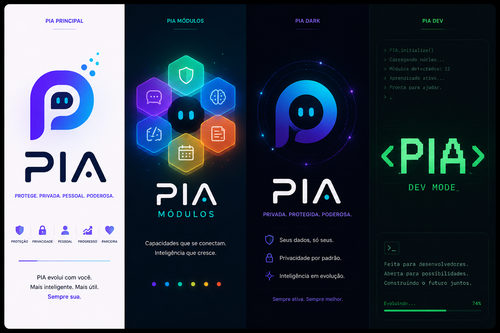

# PIA — Coleção de IA locais

PIA é uma coleção de utilitários e pequenos serviços de inteligência artificial que rodam localmente, sob demanda, com foco em baixo consumo de memória, privacidade (funcionam off-line) e integração simples com o Windows via AutoHotkey.

O objetivo principal do projeto é fornecer ferramentas prontas para uso que realizam tarefas comuns de voz — transcrição (Speech-to-Text) e síntese (Text-to-Speech) — de forma leve e integrada ao sistema operacional, sem depender de serviços remotos.

Principais características
- Funciona localmente (offline-ready).
- Baixo consumo de memória quando o serviço está ocioso (tipicamente < 2 MB conforme os subprojetos).
- Integração com Windows via AutoHotkey para atalhos globais e automação.
- APIs HTTP locais simples para integração com outras aplicações (ex: SillyTavern, clientes web, AutoHotkey, etc.).

Como usar (visão rápida)
1. Abra um PowerShell na pasta do subprojeto desejado (por exemplo `speech_to_text` ou `text_to_speech`).
2. Execute o instalador do subprojeto para preparar dependências e criar atalhos:

```powershell
Set-ExecutionPolicy -Scope Process Bypass
.\install.ps1
```

3. Execute o servidor Python do subprojeto (cada subprojeto tem um `server.py`) ou use os atalhos criados na pasta `startup` para rodar os scripts do AutoHotkey.

Contribuições e desenvolvimento
- Esse repositório é modular: adicione novos serviços na raiz (por exemplo, um módulo para análise de sentimentos ou um chatbot offline) seguindo o padrão de ter um `server.py`, `install.ps1` e atalhos em `startup/` quando fizer sentido.
- Antes de abrir PRs, rode os scripts de instalação e garanta que as novas dependências sejam compatíveis com execução local e sejam adicionadas em `requirements.txt` correspondentes.



## Serviços
### Servidor de Text to Speech (TTS) PORT=8765
* `POST /speak`: Adiciona o texto enviado à fila de síntese para reprodução direta nas caixas de som locais em segundo plano.
* `POST /stop`: Interrompe a reprodução de áudio em andamento e limpa a fila de processamento local.
* `POST /generate`: Sintetiza o texto enviado e retorna o áudio em formato nativo `audio/wav` no corpo da resposta HTTP (ideal para SillyTavern e clientes web).
* `GET /status`: Retorna o estado atual da aplicação, indicando se o player está reproduzindo áudio, o dispositivo em uso (`cuda`/`cpu`) e se o modelo Kokoro está carregado em memória.

# Servidor de Speech to Text (TTS) PORT=8767
* `POST /start`: Inicia a captura de áudio pelo microfone.
* `POST /stop`: Interrompe a gravação e processa o trecho final.
* `GET /status`: Retorna o estado atual da gravação, transcrição e entrega os blocos de texto processados.

# Servidor do Agent (AGENT) PORT=8766

# Servidor do Wake Word (WW) PORT=8768


## Rodar local

`.venv\Scripts\Activate.ps1`
`python server.py`

