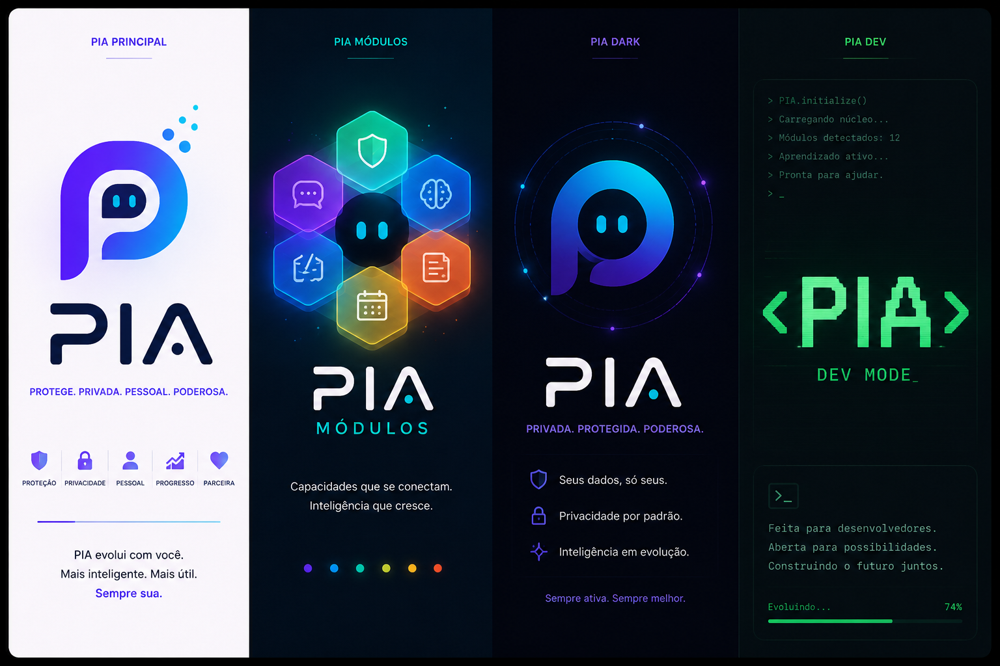

# PIA — Coleção de IA locais
PIA é uma coleção de utilitários e pequenos serviços de inteligência artificial que rodam localmente, sob demanda, com foco em baixo consumo de memória, privacidade (funcionam off-line) e integração simples com o Windows via AutoHotkey.

O objetivo principal do projeto é fornecer ferramentas prontas para uso que realizam tarefas comuns de voz — transcrição (Speech-to-Text) e síntese (Text-to-Speech) — de forma leve e integrada ao sistema operacional, sem depender de serviços remotos.

Principais características
- Funciona localmente (offline-ready).
- Baixo consumo de memória quando o serviço está ocioso (tipicamente < 2 MB conforme os subprojetos).
- Integração com Windows via AutoHotkey para atalhos globais e automação.
- APIs HTTP locais simples para integração com outras aplicações (ex: SillyTavern, clientes web, AutoHotkey, etc.).

Como usar (visão rápida)
1. Abra um PowerShell na pasta do subprojeto desejado (por exemplo `speech_to_text` ou `text_to_speech`).
2. Execute o instalador do subprojeto para preparar dependências e criar atalhos:

```powershell
Set-ExecutionPolicy -Scope Process Bypass
.\install.ps1
```

3. Execute o servidor Python do subprojeto (cada subprojeto tem um `server.py`) ou use os atalhos criados na pasta `startup` para rodar os scripts do AutoHotkey.

Contribuições e desenvolvimento
- Esse repositório é modular: adicione novos serviços na raiz (por exemplo, um módulo para análise de sentimentos ou um chatbot offline) seguindo o padrão de ter um `server.py`, `install.ps1` e atalhos em `startup/` quando fizer sentido.
- Antes de abrir PRs, rode os scripts de instalação e garanta que as novas dependências sejam compatíveis com execução local e sejam adicionadas em `requirements.txt` correspondentes.



## Serviços
# Servidor do Wake Word (WW) PORT=8760


# Servidor do Agent (AGENT)

Padrão OpenAI:
- `GET /v1/models`

## Images - Servidor de Criação e Edição de Imagens com o ConfyUI
* `POST /v1/images/generations`:
* `POST /v1/images/edits`:
* `POST /v1/images/variations`:

### Audio
OpenIA:
* `POST   /v1/audio/speech`:
* `POST   /v1/audio/transcriptions`:
* `POST   /v1/audio/translations`:
* `POST   /v1/audio/voices`:

MyRoutes:
* `GET /stt/start`: Inicia a captura de áudio pelo microfone.
* `GET /stt/stop`: Interrompe a gravação e processa o trecho final.
* `GET /stt/status`: Retorna o estado atual da gravação, transcrição e entrega os blocos de texto processados.
* `GET /stt/status/stream`: 
* `GET /tts/status`: Retorna o estado atual da aplicação, indicando se o player está reproduzindo áudio, o dispositivo em uso (`cuda`/`cpu`) e se o modelo Kokoro está carregado em memória.
* `GET /tts/status/stream`:
* `GET /tts/help`:
* `POST /tts/speak`:Adiciona o texto enviado à fila de síntese para reprodução direta nas caixas de som locais em segundo plano.
* `POST /tts/storytelling`: 
* `POST /tts/stream_text`: Rota eventstream que recebe trechos do texto organiza em frases e envia para o tts reproduzir. O tts le o texto com pm_santa mas os trechos entre " se antes do texto tiver um identificador de interlocutor entre [], ele envia todo o contexto para a llm decidir se o interlocutor é homem ou mulher, armazena o sexo dele no arquivo de selectedVoices.json. interlocutores identificados como homem usam a voz pm_alex e mulher usa a voz pf_dora
* `POST /tts/stop`: Interrompe a reprodução de áudio em andamento e limpa a fila de processamento local.
* `POST /tts/generate`: Sintetiza o texto enviado e retorna o áudio em formato nativo `audio/wav` no corpo da resposta HTTP (ideal para SillyTavern e clientes web).

## Rodar local

`.venv\Scripts\Activate.ps1`
`uv run python -m server`
`python server.py`

# Servidor de Speech to Text (TTS)

Servidor local de **Speech-to-Text (STT)** em Python alimentado por **Faster-Whisper** e integrado ao Windows via **AutoHotkey (AHK)**.

Ao acionar o atalho no teclado, o sistema capta o áudio do microfone, processa a transcrição em tempo real via modelos Whisper e digita o texto automaticamente na janela ativa.

Custo de memoria parado < 2 mb


## Instaladores e Pré-requisitos
- (AutoHotKey)[https://www.autohotkey.com/]
* Python 3.12


## 🚀 Instalação
1. Abra PowerShell nesta pasta.
2. Execute:
```powershell
cd speech_to_text
Set-ExecutionPolicy -Scope Process Bypass
.\install.ps1
```
3. Execute os dois arquivos da pasta `startup`, um atalho foi criado no seu `shell:startup` para a proxima inicialização.


## Atalhos
- Ctrl+Alt+D: Inicia/Para Transcrição de voz


## **5. Endpoints da API Local**
O servidor responde no host e porta configurados via `.env`:

- `POST /start`: Inicia a captura de áudio pelo microfone.
- `POST /stop`: Interrompe a gravação e processa o trecho final.
- `GET /status`: Retorna o estado atual da gravação, transcrição e entrega os blocos de texto processados.

Padrão OpenAI:
- `POST /v1/audio/transcriptions` 
- `GET /v1/models`
- `OPTIONS` para CORS

O endpoint de transcrição aceita:

- `multipart/form-data` no padrão OpenAI (`file`, `model`, `language`, `prompt`, `temperature`, `response_format`);
- upload multipart com `Transfer-Encoding: chunked`, usado pelo Open WebUI quando ele faz streaming do arquivo;
- JSON/Base64 no formato opcional do Open WebUI (`input_audio.data`);
- `response_format=json`, `text` e `verbose_json`.

O campo `model` recebido é aceito para compatibilidade de protocolo. A inferência continua usando o modelo definido por `STT_MODEL` no seu `.env`.


# Servidor de Text to Speech (TTS)

Este projeto executa um servidor em Python (`server.py`) responsável por sintetizar texto em áudio utilizando o modelo neural **Kokoro TTS** e reproduzir o resultado via **SoundDevice**.

Custo de memoria parado < 2 mb

## Instaladores e Pré-requisitos
- (AutoHotKey)[https://www.autohotkey.com/]
- (espeak-ng)[https://github.com/espeak-ng/espeak-ng/releases]
* Python 3.12

## 🚀 Instalação
1. Abra PowerShell nesta pasta.
2. Execute:
```powershell
cd text_to_speech
Set-ExecutionPolicy -Scope Process Bypass
.\install.ps1
```
3. Execute os dois arquivos da pasta `startup`, um atalho foi criado no seu `shell:startup` para a proxima inicialização.

## Atalhos
- Ctrl+Alt+T: Inicia/Para Leitura da clipboard

## GPU
O instalador usa PyTorch 2.11.0 com CUDA 12.8. O script verifica `torch.cuda.is_available()` e usa a GPU automaticamente.

## Segurança
O servidor HTTP escuta somente local ele não fica exposto na rede.

## **Endpoints da API Local**
O servidor responde no host e porta configurados via `.env`:

* `POST /speak`: Adiciona o texto enviado à fila de síntese para reprodução direta nas caixas de som locais em segundo plano.
* `POST /stop`: Interrompe a reprodução de áudio em andamento e limpa a fila de processamento local.
* `POST /generate`: Sintetiza o texto enviado e retorna o áudio em formato nativo `audio/wav` no corpo da resposta HTTP (ideal para SillyTavern e clientes web).
* `GET /status`: Retorna o estado atual da aplicação, indicando se o player está reproduzindo áudio, o dispositivo em uso (`cuda`/`cpu`) e se o modelo Kokoro está carregado em memória.

Padrão OpenAI:
- `POST /v1/audio/speech`
- `GET /v1/models`


## Endpoints
- `GET /v1/models`
- `POST /v1/images/generations`
- `POST /v1/images/edits`
- `POST /v1/images/variations`
- `GET /health`
- `GET /v1/images/files/<arquivo>` para `response_format=url`

Para o modelo `sd_xl_base_1.0.safetensors` imagens menores que 1024x1024 geram imagens ruins.

## Ciclo de memória

Por padrão os jobs são serializados. Depois de baixar a imagem final do ComfyUI, o gateway executa no `finally`:

1. `GET /queue`;
2. se não houver job rodando ou pendente, `POST /free`;
3. envia `{ "unload_models": true, "free_memory": true }`.

Isso evita que uma requisição descarregue o modelo enquanto outra o utiliza.

## Qual FLUX está instalado?

### Checkpoint all-in-one

O checkpoint oficial all-in-one Schnell FP8 é carregado por `CheckpointLoaderSimple` e deve ficar em `models/checkpoints`.

```env
COMFYUI_MODEL_LAYOUT=checkpoint
COMFYUI_CHECKPOINT=flux1-schnell-fp8.safetensors
```

Seu volume atual atende esse layout:

```yaml
- ./cache:/home/user/ComfyUI/models/checkpoints
```

## Download do modelo
# command: >
#   bash -c "
#   if [ ! -f /home/user/ComfyUI/models/checkpoints/flux1-schnell.safetensors ]; then
#     echo 'Baixando o modelo FLUX.1 Schnell...' &&
#     wget --header=\"Authorization: Bearer $$HF_TOKEN\" -O /home/user/ComfyUI/models/checkpoints/flux1-schnell.safetensors https://huggingface.co/black-forest-labs/FLUX.1-schnell/resolve/main/flux1-schnell.safetensors;
#   fi &&
#   exec /home/user/venv/bin/python main.py --highvram --listen 0.0.0.0
#   "

### Split/full

O `flux1-schnell.safetensors` full/split é carregado por `UNETLoader` e exige os text encoders e o VAE separados:

```env
COMFYUI_MODEL_LAYOUT=split
COMFYUI_UNET=flux1-schnell.safetensors
COMFYUI_CLIP_L=clip_l.safetensors
COMFYUI_T5XXL=t5xxl_fp8_e4m3fn.safetensors
COMFYUI_VAE=ae.safetensors
```

Estrutura:

```text
models/diffusion_models/flux1-schnell.safetensors
models/text_encoders/clip_l.safetensors
models/text_encoders/t5xxl_fp8_e4m3fn.safetensors
models/vae/ae.safetensors
```

Nesse caso monte o diretório `models` inteiro no container, não apenas `checkpoints`.

## Testes

### ComfyUI

```powershell
curl.exe http://127.0.0.1:8188/system_stats
curl.exe http://127.0.0.1:8188/models/checkpoints
```

Para split:

```powershell
curl.exe http://127.0.0.1:8188/models/diffusion_models
curl.exe http://127.0.0.1:8188/models/text_encoders
curl.exe http://127.0.0.1:8188/models/vae
```

### Gateway

```powershell
curl.exe http://127.0.0.1:8764/health
curl.exe -H "Authorization: Bearer local" http://127.0.0.1:8764/v1/models
```

### Geração

```powershell
curl.exe -X POST "http://127.0.0.1:8764/v1/images/generations" `
  -H "Authorization: Bearer local" `
  -H "Content-Type: application/json" `
  -d "{\"model\":\"gpt-image-1\",\"prompt\":\"a glass castle under an aurora\",\"size\":\"1024x1024\",\"n\":1,\"response_format\":\"b64_json\"}" `
  -o response.json
```

### Edição

```powershell
curl.exe -X POST "http://127.0.0.1:8764/v1/images/edits" `
  -H "Authorization: Bearer local" `
  -F "model=gpt-image-1" `
  -F "prompt=turn the sky into a dramatic aurora" `
  -F "image=@input.png;type=image/png" `
  -F "response_format=b64_json" `
  -o edit.json
```

### Edição com máscara

O caminho implementado usa o canal alpha do PNG. Áreas transparentes são tratadas como editáveis, coerentemente com a máscara de edição OpenAI e com a máscara retornada pelo `LoadImage` do ComfyUI.

```powershell
curl.exe -X POST "http://127.0.0.1:8764/v1/images/edits" `
  -H "Authorization: Bearer local" `
  -F "model=gpt-image-1" `
  -F "prompt=replace the masked object with a crystal relic" `
  -F "image=@input.png;type=image/png" `
  -F "mask=@mask.png;type=image/png" `
  -F "response_format=b64_json" `
  -o edit-mask.json
```

## Open WebUI

Se o gateway roda no Windows e o Open WebUI em Docker:

```text
Engine: OpenAI
Base URL: http://host.docker.internal:8764/v1
API key: local
Model: gpt-image-1
```

O Open WebUI atual chama `/images/generations` sobre essa base. O gateway devolve `b64_json` por padrão e também suporta `url`.


# Voice Agent

Agente pessoal por voz para Windows.

- Segure **Ctrl + Alt + D** para gravar.
- Solte para enviar o áudio à API do Gemini.
- O Gemini transcreve a fala e decide entre responder, executar ações locais, usar memória ou iniciar aprendizado.
- A memória persistente fica em **`data/memory.json`**.
- A LLM nunca recebe um executor de shell arbitrário.

## 1. Instalação

Abra PowerShell nesta pasta e execute:

```powershell
Set-ExecutionPolicy -Scope Process Bypass
.\install.ps1
```

Depois abra `.env` e preencha:

```dotenv
GEMINI_API_KEY=SUA_CHAVE_AQUI
```

Por padrão o projeto usa `gemini-3.5-flash-lite` tanto para STT remoto quanto para interpretação.

Execute `stt.ahk` com **AutoHotkey v2**.

## 2. Push-to-talk

```text
Ctrl+Alt+D DOWN  -> POST /start -> gravação local em memória
Ctrl+Alt+D UP    -> POST /stop  -> WAV -> Gemini -> agente
```

O áudio não é transcrito localmente e não há Whisper/CUDA.

## 3. Ações iniciais

### Apagar tudo

Fala:

```text
apaga tudo
```

Executa `Ctrl+A` e `Backspace` no aplicativo ativo.

### Enviar

Fala:

```text
enviar
```

Pressiona `Enter`.

### Abrir programa/site

Exemplos:

```text
abre o Chrome
abre o VS Code
abre o YouTube
```

Programas por nome são abertos pela pesquisa do menu Iniciar. URLs explícitas usam o navegador padrão.

## 4. Perguntas e resposta falada

Perguntas comuns recebem uma resposta curta do Gemini e são enviadas ao TTS.

Para previsão do tempo existe uma ferramenta real baseada em Open-Meteo, sem chave de API adicional:

```text
quantos graus vai fazer amanhã?
```

A localização padrão vem de `DEFAULT_LOCATION` no `.env`.

## 5. TTS

Por padrão:

```dotenv
TTS_MODE=sapi
```

usa `System.Speech` do Windows.

Para usar seu próprio programa de voz:

```dotenv
TTS_MODE=command
TTS_COMMAND=C:\caminho\meu_tts.exe
```

O texto é passado como último argumento. O TTS não usa o clipboard, porque o clipboard é parte do mecanismo de aprendizado.

Se o TTS for um script AHK:

```dotenv
TTS_MODE=command
TTS_COMMAND=C:\Program Files\AutoHotkey\v2\AutoHotkey64.exe
TTS_SCRIPT=C:\caminho\tts.ahk
```

Seu script receberá o texto em `A_Args[1]`.

## 6. Aprendizado de memória

Há uma diferença deliberada entre **aprender um dado** e **aprender código novo**.

### Exemplo: jogo do Roque

Primeira vez:

```text
Você: Abre o jogo do roque no youtube.
Agente: Eu ainda não conheço esse link. Copie o link correto e depois diga pronto.
```

Você copia:

```text
https://www.youtube.com/@nossamesanossalendas
```

Depois fala:

```text
Pronto!
```

O agente lê o clipboard, valida que é uma URL HTTP/HTTPS, grava a ação em `data/memory.json`, agradece e abre o link.

A memória ficará aproximadamente assim:

```json
{
  "id": "learned_...",
  "description": "Abrir o jogo do Roque no YouTube",
  "triggers": [
    "abre o jogo do roque no youtube"
  ],
  "action": {
    "type": "open_url",
    "value": "https://www.youtube.com/@nossamesanossalendas"
  }
}
```

Na próxima vez, a frase é resolvida pela memória e executada sem precisar reaprender o link.

## 7. Aprendizado de nova capacidade

Se você pedir uma ação que não tem executor local, por exemplo:

```text
coloca o volume em 30 por cento
```

não há `exec`, PowerShell arbitrário ou shell produzido pela LLM.

Em vez disso o agente:

1. informa por voz que ainda não sabe executar a operação;
2. cria um arquivo Markdown em `learning_requests/`;
3. copia para o clipboard um prompt de implementação preparado para um agente de código;
4. abre a pasta do projeto e a proposta no VS Code.

Assim você pode usar `Ctrl+V` no seu agente de programação e implementar a nova ferramenta conscientemente.

## 8. Memória de fatos

O schema também suporta fatos persistentes. Por exemplo:

```text
lembre que meu servidor de RPG se chama Atlas
```

O roteador pode armazenar:

```json
{
  "key": "nome do servidor de RPG",
  "value": "Atlas"
}
```

Esses fatos entram no contexto das próximas interpretações.

## 9. Endpoints úteis

### Status

```http
GET /status
```

### Iniciar gravação

```http
POST /start
```

### Encerrar/processar

```http
POST /stop
```

### Testar sem microfone

Também existe um endpoint de desenvolvimento:

```http
POST /text
Content-Type: application/json

{
  "text": "abre o youtube"
}
```

Isso é útil para testar roteamento e memória antes de mexer com áudio.

## 10. Segurança deliberada

O modelo só pode produzir tipos de ação enumerados em `src/models.py`. A execução local é implementada explicitamente em `src/actions.py`.

Uma resposta da LLM nunca é passada diretamente para `cmd.exe`, PowerShell, `exec()` ou `shell=True`.

Ações aprendidas no JSON atualmente executam apenas tipos conhecidos, como `open_url` e `open_path`. Guardar no JSON algo parecido com código não torna esse conteúdo executável.
